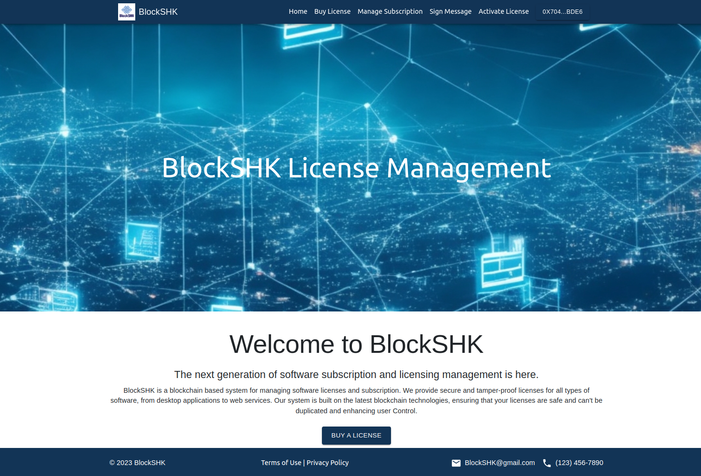

# BlockSHK Customer Application

Welcome to BlockSHK Customer Application! This is a blockchain-based platform designed for managing software licenses and subscriptions. BlockSHK provides a secure and tamper-proof solution for handling software licenses through blockchain technology.

 <!-- Change 'path_to_screenshot.png' with the actual screenshot path -->

## Features

- Purchase software licenses.
- Manage your subscriptions.
- Seamlessly integrate with blockchain technologies.
- Partnered with Microsoft, Adobe, and Oracle.
- Secure and tamper-proof license management.

## Getting Started

These instructions will get you a copy of the project up and running on your local machine for development and testing purposes.

### Prerequisites

- Make sure you have [Node.js](https://nodejs.org/en/) installed on your machine.
- Install MetaMask as a browser extension. [Get MetaMask](https://metamask.io/download.html).

### Installation

1. Clone the repository

```
git clone https://github.com/BlockSHK/customer-ui.git
```

2. Navigate to the project directory

```
cd customer-ui
```

3. Install dependencies

```
npm install
```

### Running the Application

1. Start the development server

```
npm start
```

2. Open your web browser and navigate to [http://localhost:3000](http://localhost:3000) to view the application.

## Deployment

The application is deployed and accessible at [BlockSHK Customer UI](https://blockshk.github.io/customer-ui/).

For more information on deploying applications created with Create React App, please refer to the [Create React App deployment documentation](https://facebook.github.io/create-react-app/docs/deployment).

## Contributing

We welcome contributions from the community. Here's how you can contribute:

1. Fork the Project
2. Create your Feature Branch (`git checkout -b feature/AmazingFeature`)
3. Commit your Changes (`git commit -m 'Add some AmazingFeature'`)
4. Push to the Branch (`git push origin feature/AmazingFeature`)
5. Open a Pull Request

## License

Distributed under the MIT License. See `LICENSE` for more information.

## Contact

For any queries or further information, feel free to reach out to us:

- Hithru: [hithru.18@cse.mrt.ac.lk](mailto:hithru.18@cse.mrt.ac.lk)

Project Link: [https://github.com/BlockSHK/customer-ui](https://github.com/BlockSHK/customer-ui)
